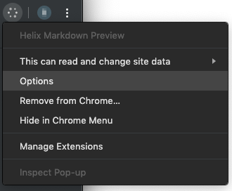

# Helix Markdown Preview
Google Chrome Extension to preview markdown files on GitHub, either static or live as you type. It can have markdown rendered standalone, or using Helix.

## 1. Installation

### 1.1 Developer mode
1. Clone this repository to your local disk: `git clone https://github.com/rofe/helix-markdown-preview.git`
2. Open Chrome and navigate to `chrome://extensions`
3. Turn on _Developer mode_ at the top right of the header bar 

4. Click the _Load unpacked_ button in the action bar 

5. Navigate to the `src` directory of your local clone and click _Select_ to install and activate the extension
6. Verify if your _Extensions_ page displays a box like this: 
 
   and the tool bar shows a grayed out Helix icon: 

### 1.2 End user mode
Stay tuned...

## 2. Usage

### 2.1 Static preview
1. Navigate to any markdown (\*.md) file on GitHub, like [this one](https://github.com/adobe/project-helix.io/blob/master/index.md) for example.
2. Click the _Raw_ button. Notice how the Helix icon in the toolbar is colored now: 

3. Click it.
4. A popup opens, showing the rendered output.

### 2.2 Preview as you type
1. Navigate to any markdown (\*.md) file on GitHub.
2. Click the pencil icon to switch to editing mode (only available if you have write access). Notice how the Helix icon in the toolbar is colored now: 

3. Click it.
4. A popup opens, showing the rendered output.
5. Edit the markdown and observe the changes in the popup.

The zoom factor in the preview window is adjusted automatically to the window size. You can also set it manually using the dropdown at the top right.

### 2.3 Helix Configuration

By default, markdown will be rendered in standalone mode in your browser. In order to let a Helix server render the markdown, follow these steps:

1. Start a local Helix server. See [www.project-helix.io](https://www.project-helix.io) how to set it up.
2. Open a new browser window, click the grayed out Helix icon in the toolbar and select _Options_: 

3. Click the checkbox to enable Helix rendering.
4. Provide the base URL of your Helix server, e.g. `http://localhost:3000`.
5. Navigate to a markdown (\*.md) file, e.g. `index.md`, in your project's repository on GitHub. In theory, you can use any markdown file from any repository, as long as the file path can be matched on your Helix server.
6. Click either the _Raw_ button (for static preview) or _pencil_ icon (for live preview), then Helix icon in the tool bar.
7. A popup opens, showing the rendered output from Helix.

Non-local Helix servers are currently not supported.

## 4. 3rd party dependencies

Helix Markdown Preview uses the following libraries:
* [Marked](https://github.com/markedjs/marked) JS library to render markdown in the preview ([MIT License](https://opensource.org/licenses/MIT))
* [diffDOM](https://github.com/fiduswriter/diffDOM) JS library to diff DOM elements ([LGPL v3](https://www.gnu.org/licenses/lgpl-3.0.txt))
* [Primer](https://primer.style/) CSS for GitHub-style output ([MIT License](https://opensource.org/licenses/MIT))
